# AI STUDIO
An AI-powered chatbot built with Python, Streamlit, Google Gemini API, and MySQL. The application provides an interactive chat interface with conversation history, authentication, file upload support, document generation, YouTube video understanding, and optional Google Search integration.
## FEATURES
- User Authentication (Login & Registration)
- Passwords are hashed using bcrypt and they are never stored in plain text.
- Real-time AI conversations using Google Gemini
- Automatic chat title generation
- Persistent chat history stored in MySQL
- Pin important conversations
- Optional Google Search integration for up-to-date responses
- Upload and analyze:
    - Images
    - PDF files
    - Videos
- Summarize and answer questions about YouTube videos using video URLs
- Generate downloadable documents:
    - PDF
    - DOCX
    - CSV
- Adjustable model parameters:
    - Temperature
    - Top-P
    - Top-K
    - Maximum Output Tokens
- Clean and responsive Streamlit interface
## Tech Stack
- Frontend
    - Streamlit
- Backend
    - Python
- AI
    - Google Gemini API (google-genai)
- Database
    - MySQL
- Libraries
    - pandas
    - streamlit
    - python-docx
    - xhtml2pdf
    - mysql-connector-python
    - python-dotenv
    - pydantic
    - google-genai
    - bcrypt
    - PyJWT
    - streamlit-cookies-controller
## Install dependencies
``` 
pip install -r requirements.txt 
```
## Configure environment variables
Create a .env file:
```
GOOGLE_API_KEY=YOUR_API_KEY
DB_HOST=localhost
DB_USER=root
DB_PASSWORD=your_password
DB_NAME=your_database
```
## Project Structure
```
├── app.py                 # Main Streamlit application
├── chatbot.py              # Gemini chat logic
├── database.py             # Database connection
├── auth.py                 # User authentication
├── file_generate.py        # Document generation
├── display.py              # Chat message rendering
├── utils.py                # Helper functions
├── Analytics.py            # Helper for displaying analytics
├── config.py               # Environmental variables, cookie controller
├── uploads/                # Uploaded files
├── generated_files/        # Generated documents
└── requirements.txt
├── ui/                     # Files containing the render of application
    ├── chat_display.py                 
    ├── settings.py                     
    ├── display_analytics.py
    ├── sidebar.py
    ├── welcome.py
```
## Run the application
```
streamlit run app.py
```
## Database Setup

[schema.sql](schema.sql) creates the database itself (ai_studio_db), so there's no need to create it manually first.

#### Option A: Standard MySQL install

```bash
mysql -u root -p < schema.sql
```


Update the credentials in `get_db_connection` in [`database.py`](./database.py).

#### Option B: XAMPP

XAMPP ships its own MySQL (MariaDB) server, usually running on port 3306 with the default user root and *no password*.

1. Open the *XAMPP Control Panel* and start the *MySQL* module (and *Apache*, if you plan to use phpMyAdmin).
2. Import the schema using either method below:
   - *phpMyAdmin* (easiest): go to http://localhost/phpmyadmin, click *Import, choose schema.sql, and click **Go*. This creates the ai_studio_db database and all its tables.
   - *Command line*: run the mysql binary from your XAMPP install instead of a system-wide one, since XAMPP's MySQL usually isn't on your PATH by default.
     - Windows: C:\xampp\mysql\bin\mysql.exe -u root < schema.sql
     - macOS: /Applications/XAMPP/xamppfiles/bin/mysql -u root < schema.sql
     - Linux: /opt/lampp/bin/mysql -u root < schema.sql
## Document Generation

The chatbot can generate downloadable documents based on user requests.

### Supported formats:

- PDF
- DOCX
- CSV

The AI returns structured JSON, which is processed into downloadable files.
File Upload Support

## Users can upload:

- Images
- PDF documents
- Videos

Uploaded files are sent to Gemini for analysis along with the user's prompt.
## YouTube Support
Paste a YouTube URL along with your prompt to:

- Summarize videos
- Ask questions about video content
- Extract key information
## Web Search

Enable Google Search to allow Gemini to retrieve recent information from the web before generating a response.

## Screenshots
### Login

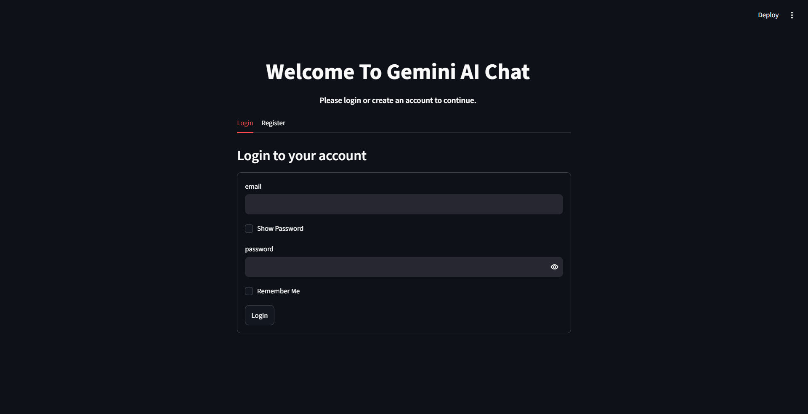
### Register account for new user

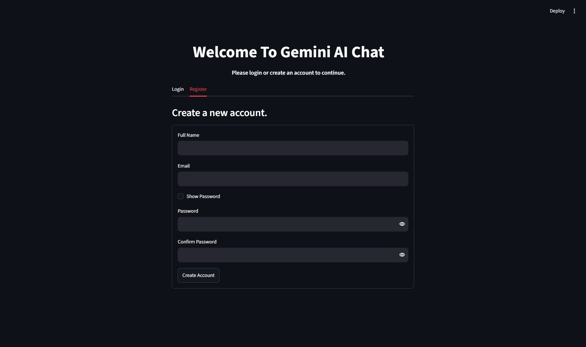
### Home Page

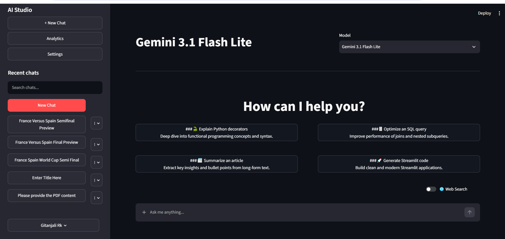
### Chat Interface

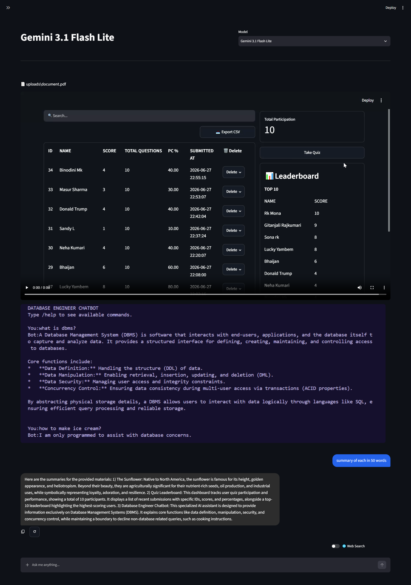
### Web Search
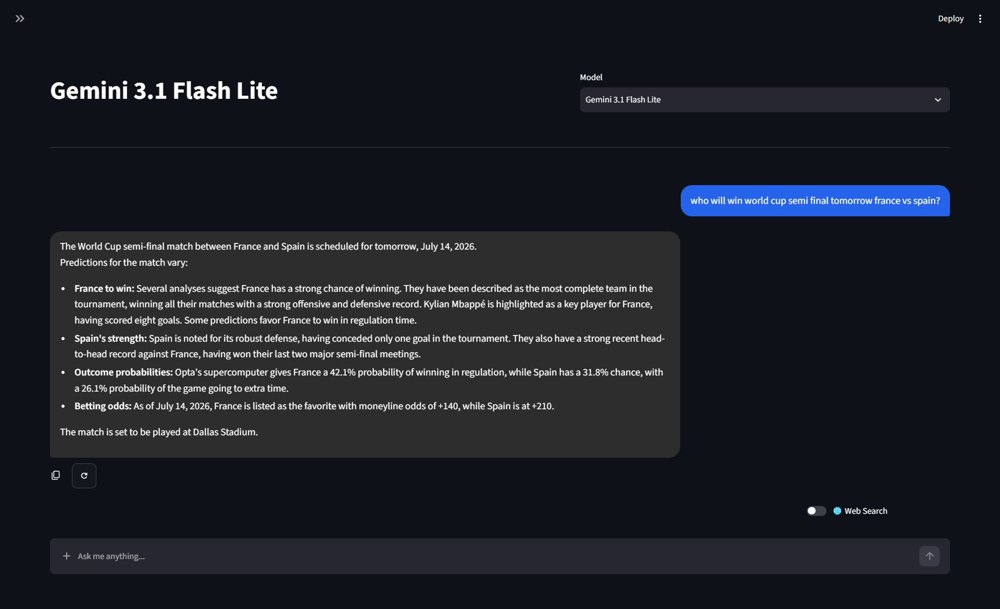
### Document Creation
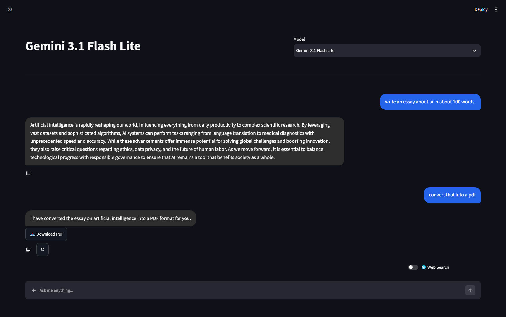
### Settings
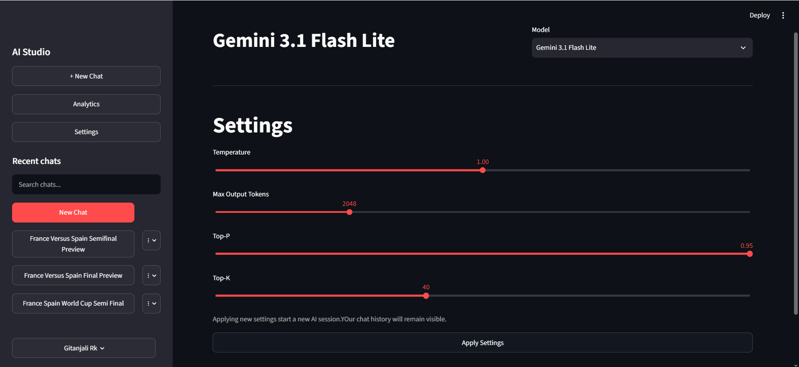
### Analytics
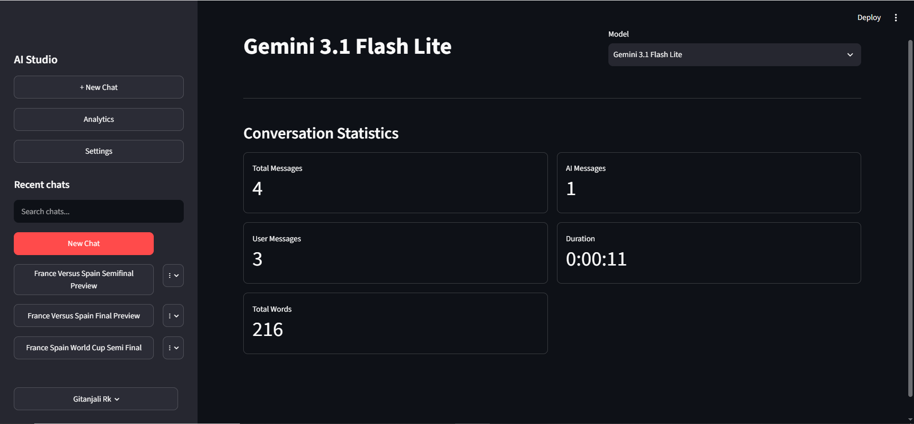
### Pin important chats
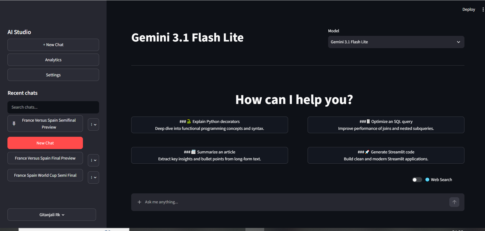
### Delete Chat
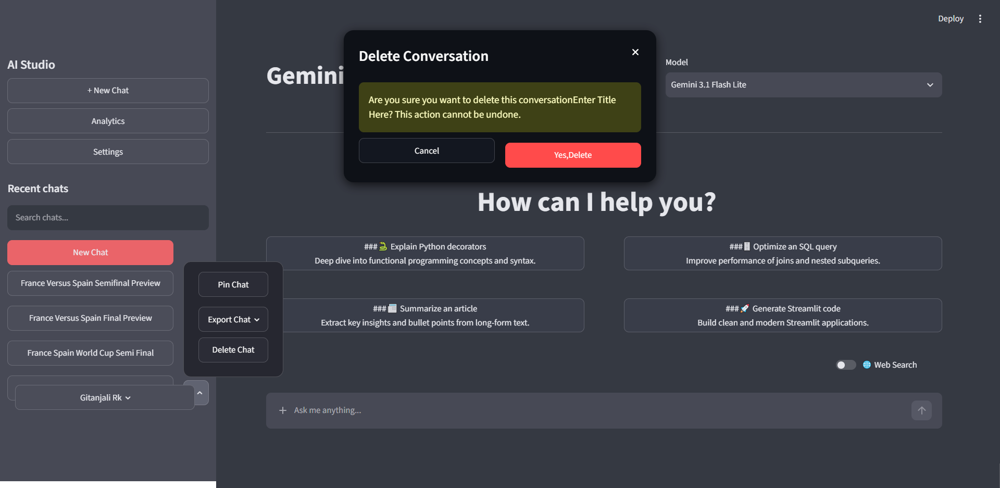
### Export chat in json or txt format
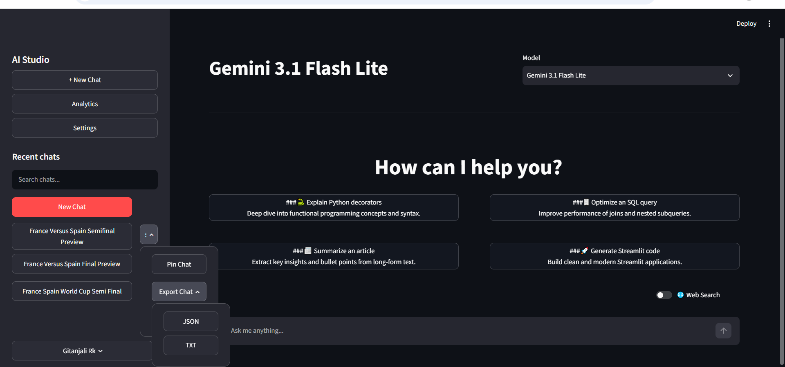
### Change model 
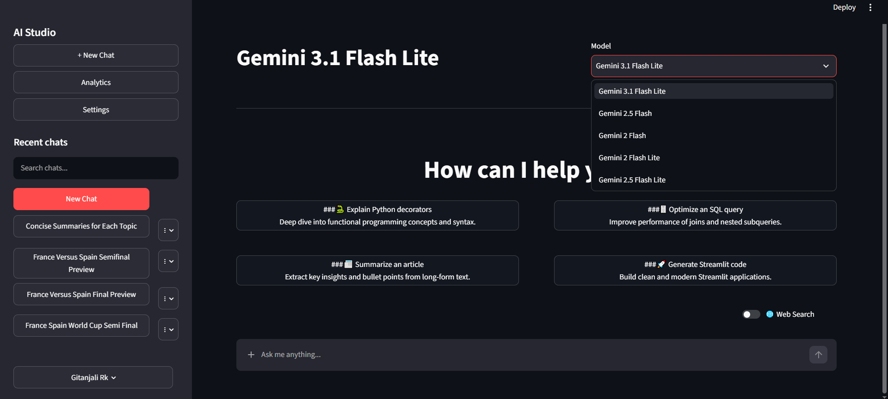
### Search a specific chat
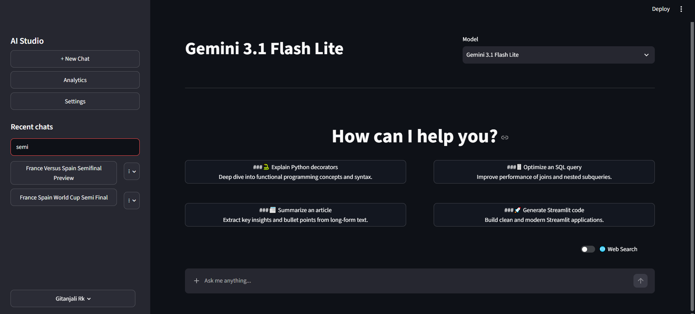
### Logout
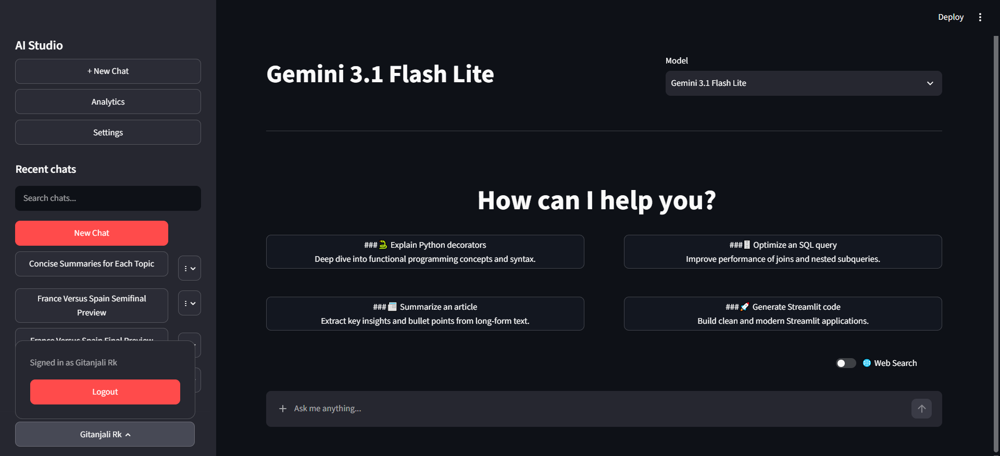
